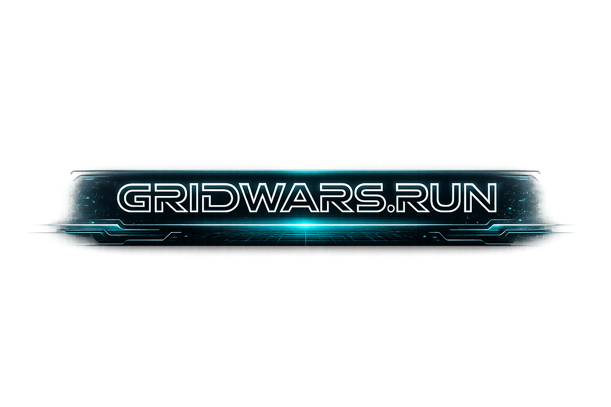
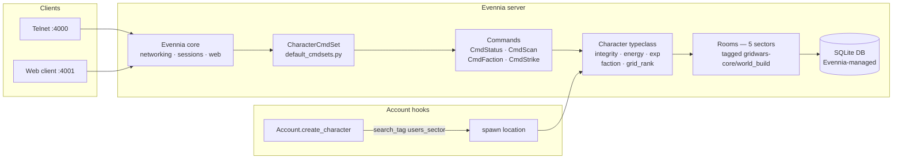

<div align="center">



### Open-source PvP MUD on the Grid — full PvP, no deletion, no pay-to-win

[]()
[](LICENSE)
[](pyproject.toml)
[](vendor/evennia)
[](.github/workflows/test.yml)

[**Quick start**](#quick-start) ·
[**Why GridWars**](#why-gridwars) ·
[**Features**](#feature-catalog) ·
[**Architecture**](#architecture) ·
[**Self-host**](#self-host) ·
[**Contributing**](#contributing)

</div>

---

## What is GridWars.run

GridWars.run is an open-source, text-based real-time PvP world built for the Grid — a cyber-digital arena inspired by TRON and classic digital combat aesthetics. Five sectors span the map: Users' Sector (the spawn point), Lightcycle Causeway, Daemon Gate, Archive Node, and Combat Grid. Choose your allegiance — **Users**, **Programs**, or **Daemons** — and traverse the causeway, breach the gate, or derez rival programs in the Combat Grid.

Unlike modern pay-to-win MMOs, GridWars has no subscription, no cash shop, no character deletion, and no server-side secrets. Everything runs from a single `git clone`. Unlike classic AberMUD-era games, GridWars ships with a web client alongside the telnet port and is built on a modern Python 3.12 stack. It's designed for operators who want to run a world for themselves and their friends — and for contributors who want to extend it.

The engine is Evennia v6.0.0 — a mature Python/Django MUD framework — vendored at `vendor/evennia/` and never modified. Game logic lives entirely in the `gridwars/` game directory. The full codebase is AGPL-3.0-or-later.

If you want to play, see [Quick start](#quick-start). If you want to host or extend, see [Self-host](#self-host) and [Architecture](#architecture).

---

## Quick start

**From clone to connected in five commands:**

```bash
git clone --recurse-submodules https://github.com/jsgerman-oss/gridwars.run.git
cd gridwars.run
make install          # one-time: creates .venv/ with Python 3.12, installs vendored Evennia
make migrate          # one-time: initialise the SQLite DB (non-interactive)
make createsuperuser  # interactive: create your in-game #1 character
make run              # boot the server (telnet 4000, web 4001)
```

Then connect:

- **Telnet:** `telnet localhost 4000`
- **Web client:** <http://localhost:4001>

<details>
<summary><b>Platform-specific prerequisites</b></summary>

**macOS** (Intel + Apple Silicon)
- Python 3.12+: `brew install python@3.12`
- Git with submodule support is included in Xcode Command Line Tools
- `make` is included in Xcode Command Line Tools

**Linux** (Ubuntu / Debian / Fedora / Arch)
- Python 3.12 + venv: `apt-get install python3.12 python3.12-venv` (or distro equivalent)
- `make`, `git` via your package manager

**Windows**
- WSL2 is strongly recommended — Evennia is largely POSIX-oriented
- Inside WSL2, follow the Linux instructions above

</details>

### Build the world

`make run` boots an empty server. To populate the five sectors before players connect:

```bash
# After make migrate, before players log in — run the world build script:
cd gridwars && ../.venv/bin/python -c "\
import os, django; \
os.environ.setdefault('DJANGO_SETTINGS_MODULE', 'server.conf.settings'); \
django.setup(); from world import build_grid"
```

The build is idempotent — running it twice leaves the world unchanged. Full setup procedure including update-after-pull: [`docs/SETUP.md`](docs/SETUP.md).

### First playable commands

Once connected and faction-aligned (`faction choose Users` / `Programs` / `Daemons`):

| Command | What it does |
|---|---|
| `status` | Identity disc HUD — integrity, energy, exp, rank, faction |
| `scan` | Tactical sector view — programs (faction-tinted), exits, flavor |
| `faction` | List the three factions and your current alignment |
| `faction choose <name>` | Align with a faction (one-shot; admin override required to change) |
| `strike <target>` | Same-sector PvP. Defeat sends the target back to Users' Sector with restored integrity. Characters are never deleted. |
| `help gridwars` | Curated command index by category |

---

## Why GridWars

**Full PvP. No pay-to-win. No deletion.** Defeat in GridWars respawns — the losing program is moved back to Users' Sector with restored integrity. Every character comes back. Combat is mechanical (deterministic base damage plus a jitter roll), not retributive. There is no administrator power to permanently remove a character.

**Built on Evennia, extended via game directory.** Evennia v6.0.0 is vendored under `vendor/evennia/` (BSD-3-Clause), pinned to a specific commit, and never modified. GridWars game logic — commands, typeclasses, world layout, combat math — lives in `gridwars/`. Upgrading the engine is `git submodule update` plus a world rebuild. There is no monkey-patching, no fork, no divergence to maintain.

**Three factions, real consequences.** Users / Programs / Daemons are not cosmetic tags. Faction membership tints `scan` output, drives themed broadcast prose on joins and defeats, and (roadmap) will gate sector access. Choosing a faction is a one-shot, one-way decision enforced in code.

**Terminal-native, web-friendly.** Telnet on port 4000 for purists; Evennia's web client on port 4001 for everyone else. No mobile yet — that's on the roadmap.

**Open-source AGPL.** The whole game is AGPL-3.0-or-later. Run your own server. Fork the rules. Ship a variant. The vendored Evennia layer keeps its BSD-3-Clause license untouched; our code is AGPL with no exceptions.

### How GridWars compares

| | GridWars.run | Generic commercial MMO | Generic AberMUD-era MUD |
|---|:---:|:---:|:---:|
| On-device server | ✅ | ✗ | Partial |
| Real-time PvP | ✅ | ✅ | Partial |
| Faction-driven | ✅ | Partial | ✗ |
| Open source | ✅ | ✗ | Partial |
| Web client | ✅ | ✅ | ✗ |
| Telnet client | ✅ | ✗ | ✅ |
| No subscription | ✅ | ✗ | Partial |
| No character deletion | ✅ | ✗ | ✗ |

---

## Feature catalog

Status legend: **✅ Shipping · 🔬 Alpha · ⚠️ Best-effort · 🛣️ Roadmap**

### World & sectors

| Capability | Status | Source |
|---|:---:|---|
| 5 sectors with cardinal exits | ✅ | `gridwars/world/build_grid.py` |
| Idempotent build (tagged `gridwars-core`/`world_build`) | ✅ | `gridwars/world/build_grid.py` |
| Tag-based spawn resolution (Account.create_character hook) | ✅ | `gridwars/typeclasses/accounts.py` |
| Sector ownership / capture-the-grid | 🛣️ | — |

### Character system

| Capability | Status | Source |
|---|:---:|---|
| Character typeclass with persistent stats | ✅ | `gridwars/typeclasses/characters.py` |
| AttributeProperty fields: integrity / energy / experience / faction / grid_rank | ✅ | `gridwars/typeclasses/characters.py` |
| Clamping helpers: take_damage / heal / gain_experience / reset_for_respawn | ✅ | `gridwars/typeclasses/characters.py` |
| Login / logout hooks (at_post_puppet / at_pre_unpuppet) | ✅ | `gridwars/typeclasses/characters.py` |
| 9 unit tests | ✅ | `gridwars/typeclasses/tests/test_characters.py` |

### Faction system

| Capability | Status | Source |
|---|:---:|---|
| 3-faction registry (Users / Programs / Daemons) | ✅ | `gridwars/world/factions.py` |
| `faction` list command | ✅ | `gridwars/commands/factions.py` |
| `faction choose <name>` + themed room broadcast | ✅ | `gridwars/commands/factions.py` |
| One-shot enforcement (admin override required to change) | ✅ | `gridwars/commands/factions.py` |
| 8 unit tests | ✅ | `gridwars/commands/tests/test_factions.py` |

### Combat

| Capability | Status | Source |
|---|:---:|---|
| `strike <target>` same-sector PvP | ✅ | `gridwars/commands/combat.py` |
| Deterministic + jitter damage (BASE_DAMAGE + randint(0, RANDOM_BONUS_MAX)) | ✅ | `gridwars/world/combat.py` |
| Defeat flow: tag-resolved respawn to Users' Sector + integrity reset + attacker XP | ✅ | `gridwars/commands/combat.py` |
| No character deletion under any circumstance (invariant) | ✅ | `gridwars/commands/combat.py` |
| 5 unit tests | ✅ | `gridwars/commands/tests/test_strike.py` |
| Lightcycle duels (instanced PvP races) | 🛣️ | — |
| Identity discs (wieldable weapons w/ cooldowns) | 🛣️ | — |

### Info & UX commands

| Capability | Status | Source |
|---|:---:|---|
| `status` — Identity Disc HUD with color thresholds | ✅ | `gridwars/commands/status.py` |
| `scan` — tactical sector view with faction tint | ✅ | `gridwars/commands/scan.py` |
| `help gridwars` — curated command index | ✅ | `gridwars/world/help_entries.py` |
| 9 unit tests across status + scan | ✅ | `gridwars/commands/tests/` |

### Theming

| Capability | Status | Source |
|---|:---:|---|
| Connection-screen banner with project tagline | ✅ | `gridwars/server/conf/connection_screens.py` |
| Login / logout themed messages | ✅ | `gridwars/world/messages.py` |
| Faction-unaffiliated nudge on first login | ✅ | `gridwars/world/messages.py` |
| Per-faction MOTDs | 🛣️ | — |

### Engine integration

| Capability | Status | Source |
|---|:---:|---|
| Vendored Evennia v6.0.0 (BSD-3-Clause, untouched) | ✅ | `vendor/evennia/` |
| Python 3.12+ | ✅ | `pyproject.toml` |
| Django direct-call migrate (non-interactive) | ✅ | `Makefile` |
| Telnet 4000 + web client 4001 (Evennia defaults) | ✅ | `gridwars/server/conf/settings.py` |
| Postgres backend | 🔬 | `vendor/evennia/` supports it; untested at scale here |

### Tests & CI

| Capability | Status | Source |
|---|:---:|---|
| 34 unit tests (real-DB via EvenniaTest / EvenniaCommandTest) | ✅ | `gridwars/{typeclasses,commands,world}/tests/` |
| GitHub Actions CI on push + PR | ✅ | `.github/workflows/test.yml` |
| Coverage gates | 🛣️ | — |

### Docs

| Capability | Status | Source |
|---|:---:|---|
| README (this file) | ✅ | `README.md` |
| CONTRIBUTING.md | ✅ | `CONTRIBUTING.md` |
| AGENTS.md (for AI contributor agents) | ✅ | `AGENTS.md` |
| SETUP.md (run procedure + world build) | ✅ | `docs/SETUP.md` |
| CONVENTIONS.md (SPDX header rule) | ✅ | `docs/CONVENTIONS.md` |
| THIRD_PARTY_NOTICES.md (Evennia BSD-3 attribution) | ✅ | `THIRD_PARTY_NOTICES.md` |

---

## Architecture



**Extension model.** Game code lives in `gridwars/`; vendored Evennia in `vendor/evennia/` is read-only. To add a feature, write a `Command` subclass in `gridwars/commands/` and register it in `gridwars/commands/default_cmdsets.py`. See `gridwars/commands/combat.py` for a worked example. New sectors go in `gridwars/world/build_grid.py`; new factions go in `gridwars/world/factions.py`.

**State model.** Character stats are persistent via Evennia's `AttributeProperty` descriptors — no manual `save()` calls, no raw DB queries. Rooms are tagged at build time for idempotent recreation. Spawn location is resolved at character-creation time via `search_tag("users_sector", category="gridwars-core")`.

**Combat invariant.** Defeat triggers `reset_for_respawn()` on the losing character followed by `move_to(Users' Sector)`. There is no `.delete()` call anywhere in `gridwars/commands/combat.py`. This invariant is enforced by the test suite: `test_defeat_triggers_respawn_and_xp` asserts the Character row still exists in the database after a defeat.

---

## Self-host

GridWars is designed to be self-hosted. There is no managed hosted version. The [Quick start](#quick-start) section gets you a local server; to run it as a persistent server for friends:

- Bind to `0.0.0.0` instead of `localhost` in `gridwars/server/conf/settings.py` (`SERVER_HOSTNAME = "0.0.0.0"`)
- Open ports **4000** (telnet) and **4001** (web client) on your network / firewall
- Use `systemd`, `tmux`, or `screen` for persistence beyond your shell session
- Back up `gridwars/server/evennia.db3` regularly — this is the full game state

For a production-grade deployment (Postgres, reverse proxy, TLS):

- Switch to Postgres by following Evennia's database configuration guide — the `vendor/evennia/` layer supports it fully; we haven't published a GridWars-specific runbook yet (`🛣️`)
- Put nginx or Caddy in front of port 4001 for TLS termination
- Evennia's process management integrates with standard `systemd` service units

---

## Customizing GridWars

GridWars is structured for extension. Every game-specific concern lives in `gridwars/`; the vendored engine is never touched.

**Add a new in-game command.** Write a `Command` subclass in `gridwars/commands/<your_command>.py` and register it in `gridwars/commands/default_cmdsets.py`. The `gridwars/commands/combat.py` `CmdStrike` class is a worked example — it shows target resolution, error handling, stat mutation, and defeat flow.

**Add a new sector.** Extend the `SECTORS` dict and `EXITS` table in `gridwars/world/build_grid.py` with your new room. Re-run the build script — it is idempotent, so existing rooms are not recreated.

**Add a new faction.** Extend the faction registry in `gridwars/world/factions.py`. The `faction` list command and `faction choose` command pick up new entries automatically via the registry.

**Tune combat numbers.** Edit the constants in `gridwars/world/combat.py` — `BASE_DAMAGE`, `RANDOM_BONUS_MAX`, `EXP_ON_VICTORY`, `RESPAWN_INTEGRITY`. No other code changes are needed.

**Change branding.** Replace the content in `gridwars/server/conf/connection_screens.py` (the MOTD shown on connect) and `gridwars/world/messages.py` (login / logout / defeat prose templates).

Full contributor guide: [`CONTRIBUTING.md`](CONTRIBUTING.md). AI agent guidance: [`AGENTS.md`](AGENTS.md).

---

## Roadmap

| Feature | Status | Notes |
|---|:---:|---|
| Lightcycle duels (instanced PvP) | 🛣️ | Faction-rivalry mechanic in the Causeway |
| Daemon AI (autonomous NPCs) | 🛣️ | Patrol sector borders, attack on sight |
| Sector ownership / capture | 🛣️ | Faction-controlled zones with permission semantics |
| Identity discs (weapons) | 🛣️ | Cooldowns, modifiers, weapon-class diversity |
| Per-faction MOTDs | 🛣️ | Faction-specific login messages |
| Web client polish | 🛣️ | Out-of-the-box Evennia web is functional but plain |
| Mobile clients | 🛣️ | Long-term |
| Postgres production path | 🛣️ | Tested + documented |
| `make build-world` Makefile target | 🛣️ | Wrap the current Django-shell invocation |

---

## Development

```bash
git clone --recurse-submodules https://github.com/jsgerman-oss/gridwars.run.git
cd gridwars.run
make install        # creates .venv/, installs vendored Evennia editable
make migrate        # one-time DB init
make test           # runs 34 tests via evennia test .
make run            # boots server (telnet 4000, web 4001)
make stop           # stops cleanly
make createsuperuser  # create/reset the superuser character
```

CI runs `make test` on every push and PR against `main`. A green CI run is the bar for review. See [`.github/workflows/test.yml`](.github/workflows/test.yml) for the pipeline definition.

---

## Documentation

| | |
|---|---|
| Setup + run procedure | [`docs/SETUP.md`](docs/SETUP.md) |
| Coding conventions (SPDX headers, etc.) | [`docs/CONVENTIONS.md`](docs/CONVENTIONS.md) |
| Contributor guide | [`CONTRIBUTING.md`](CONTRIBUTING.md) |
| AI agent guidance (lessons learned) | [`AGENTS.md`](AGENTS.md) |
| Third-party attribution | [`THIRD_PARTY_NOTICES.md`](THIRD_PARTY_NOTICES.md) |
| In-game help index | `help gridwars` (in-game command) |

---

## Contributing

No CLA. Optional DCO sign-off (`git commit -s`) if you prefer it.

- **Add a command, sector, or faction.** See [Customizing GridWars](#customizing-gridwars) above and [`CONTRIBUTING.md`](CONTRIBUTING.md) for the full review and branch policy.
- **Bug fixes and tests.** Test files live next to the code they test (`gridwars/<package>/tests/test_*.py`). Run `make test` before opening a PR.
- **The absolute rule: do not edit `vendor/evennia/`.** Extend GridWars via the game directory. This is the only hard rule — everything else is a guideline.

Full review process and branch policy: [`CONTRIBUTING.md`](CONTRIBUTING.md).

---

## License

GridWars.run game code is licensed [AGPL-3.0-or-later](LICENSE). SPDX convention: every new GridWars source file begins with `SPDX-License-Identifier: AGPL-3.0-or-later`. See [`docs/CONVENTIONS.md`](docs/CONVENTIONS.md) for the full header rule.

Vendored Evennia retains its [BSD-3-Clause](vendor/evennia/LICENSE.txt) license, preserved untouched in `vendor/evennia/`. Third-party attribution: [`THIRD_PARTY_NOTICES.md`](THIRD_PARTY_NOTICES.md).

---

## See also

- [`CHANGELOG.md`](CHANGELOG.md) — version history (stub pending; `v0.1.0` is the first release milestone)
- [`SECURITY.md`](SECURITY.md) — vulnerability reporting policy (stub pending; report via GitHub Security Advisories)
- [Evennia](https://www.evennia.com) — the engine GridWars extends
- [Evennia v6.0.0 release](https://github.com/evennia/evennia/releases/tag/v6.0.0) — pinned upstream version

---

<sub>Built with <a href="https://www.evennia.com">Evennia</a>. Logo / theming &copy; 2026 Jay German.</sub>
